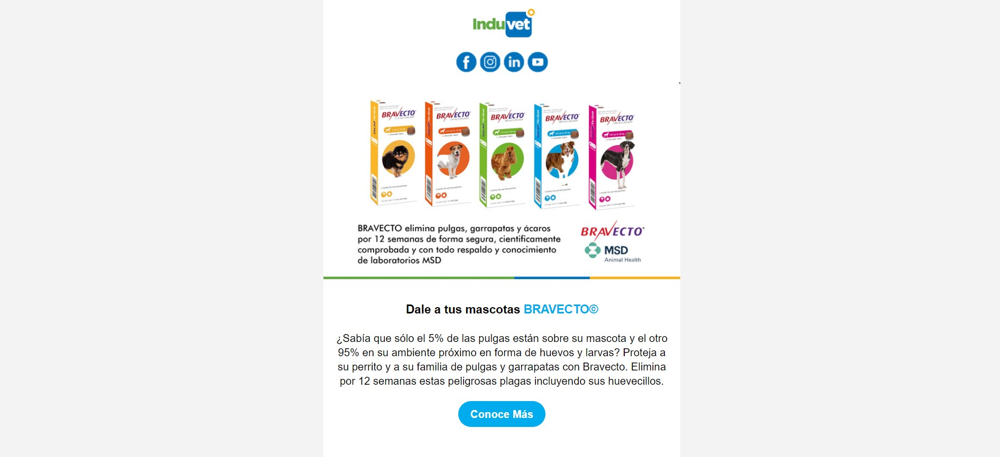
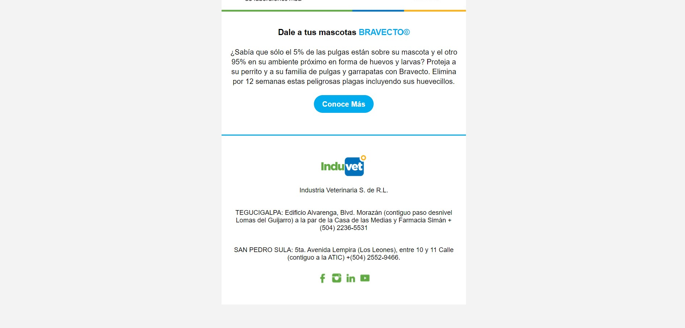

# EmailMarketing

Official **Email Marketing Campaign** for Distribuidora Realva & Industria Veterinaria S. de R.L.

### Description

Email marketing is a powerful marketing channel, a form of direct marketing as well as digital marketing, that uses email to promote your business's products or services. It can help make your customers aware of your latest items or offers by integrating it into your marketing automation efforts.

This particular email marketing campaign was used for Industria Veterinaria S. de R.L. for promotions of the Product BRAVECTO.

Bravecto´s active ingredient (fluralaner), an ectoparasiticide belonging to the isoxazoline group, is systematically active against fleas and ticks (black-legged tick, American dog tick, and brown dog tick), delivering protection for 12 weeks\*. It also kills lone star ticks for eight weeks. Presented in a highly palatable flavored chew that dogs accept readily.

Email marketing is the act of sending a commercial message, typically to a group of people, using email. In its broadest sense, every email sent to a potential or current customer could be considered email marketing. It involves using email to send advertisements, request business, or solicit sales or donations.

The pourpose is targeting our audience and customers through email. It helps you boost conversions and revenue by providing subscribers and customers with valuable information to help achieve their goals.

### Technologies

The following technologies were used for the development of the template:

- HTML
- CSS

### Design

Developed by @github/eduardodavidmm
